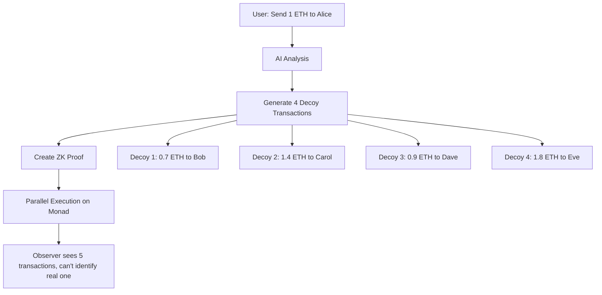

# PrivatePay 🔒

**The first consumer-grade private payment platform on Monad, combining AI-generated transaction noise with ZK proofs for untrackable payments at lightning speed.**

[](https://monad.xyz)
[](https://github.com/blorm-network/ZerePy)
[](#)
[](LICENSE)

---

## 🎯 **Problem**

All blockchain transactions are **completely public**, creating massive privacy risks:

- 💰 **Financial Surveillance** - Anyone can track your spending habits, salary, and wealth
- 🤖 **MEV Attacks** - Bots front-run your transactions for profit
- 🎯 **Targeted Attacks** - Criminals can identify and target wealthy addresses
- 🏢 **Business Espionage** - Competitors can analyze your company's financial activities

## 🚀 **Solution**

PrivatePay revolutionizes blockchain privacy through **3 breakthrough technologies**:

### 🤖 **AI-Generated Decoys**

- AI analyzes your transaction patterns
- Generates 4-8 realistic fake transactions
- Creates perfect noise to hide your real payment

### 🔒 **ZK Proof Privacy**

- Mathematical proof verifies transactions without revealing details
- Proves you have funds without showing amount or recipient
- Cryptographically guarantees privacy

### ⚡ **Monad Parallel Execution**

- All transactions (real + decoys) execute simultaneously
- Perfect timing synchronization prevents analysis
- Lightning-fast confirmation on Monad's optimized blockchain

---

## 🏗️ **How It Works**



## 🌟 **Key Features**

### **🔐 Complete Privacy**

- **98%+ Privacy Score** - Industry-leading anonymity protection
- **Untrackable Payments** - Even advanced blockchain analysis tools fail
- **Pattern Obfuscation** - AI prevents fingerprinting attacks

### **🤖 AI-Powered Intelligence**

- **Smart Decoy Generation** - Creates believable transaction patterns
- **Behavioral Analysis** - Learns from your habits for better privacy
- **Privacy Scoring** - Real-time feedback on your anonymity level

### **⚡ Lightning Fast**

- **Monad Optimization** - Built specifically for parallel execution
- **Instant Confirmation** - 1-2 second transaction finality
- **Gas Efficient** - Optimized smart contracts reduce costs

### **👤 Consumer-Friendly**

- **Simple Interface** - Privacy protection without complexity
- **One-Click Payments** - Send private payments as easily as Venmo
- **Privacy Dashboard** - Monitor and improve your anonymity score

---

## 🛠️ **Technical Architecture**

### **Smart Contracts (Solidity)**

```
├── PrivatePay.sol        # Main orchestration contract
├── PaymentVault.sol      # Secure fund management
└── ZKVerifier.sol        # Zero-knowledge proof verification
```

### **AI Agent (Python/ZerePy)**

```
├── monad_connection.py   # Blockchain interaction layer
├── privatepay_actions.py # Privacy-focused actions
└── ai_patterns.py        # Pattern analysis and decoy generation
```

### **ZK Circuits (Circom)**

```
├── private_payment.circom # Main privacy circuit
├── decoy_proof.circom     # Decoy verification
└── identity_hiding.circom # Identity obfuscation
```

## 📊 **Deployed Contracts (Monad Testnet)**

| Contract         | Address                                      | Purpose                    |
| ---------------- | -------------------------------------------- | -------------------------- |
| **PrivatePay**   | `0x06A8307922cAdcfD5d4489cF69030CA96E823145` | Main privacy orchestration |
| **PaymentVault** | `0xb5b74D0C89C936f9a5c8885Bf59f1DAd96ECaaB0` | Secure fund management     |
| **ZKVerifier**   | `0x06A8307922cAdcfD5d4489cF69030CA96E823145` | Proof verification         |

**🔗 Explorer:** [Monad Testnet Explorer](https://testnet-explorer.monad.xyz)

---

## 🚀 **Quick Start**

### **1. Prerequisites**

```bash
# Install dependencies
poetry install
npm install -g @monad/cli

# Set up environment
cp .env.example .env
# Add your private key to .env
```

### **2. Configure PrivatePay Agent**

```bash
# Start the agent
poetry run python main.py

# Load PrivatePay agent
load-agent privatepay

# Configure Monad connection
configure-connection monad
```

### **3. Make Your First Private Payment**

```bash
# Deposit funds
agent-action monad deposit-demo-funds 0.1

# Execute private payment
agent-action monad execute-demo-private-payment

# Check privacy score
agent-action monad get-privacy-score
```

### **4. API Usage**

```bash
# Start the server
poetry run python -m src.server

# Execute private payment via API
curl -X POST http://localhost:8000/privatepay/execute-payment \
  -H "Content-Type: application/json" \
  -d '{
    "recipient": "0x742d35Cc6663C4532C5cc9a6C3d9C4D5A5e1234A",
    "amount": 0.1,
    "memo": "Private payment",
    "decoy_count": 4
  }'
```

---

## 🎮 **Demo Scenarios**

### **Scenario 1: Privacy-Conscious Professional**

Sarah, a software engineer, doesn't want colleagues tracking her salary and expenses.

```bash
# Send rent payment privately
agent-action monad execute-private-payment \
  --recipient "0x..." --amount 2.5 --memo "Monthly rent"
```

### **Scenario 2: DeFi Power User**

Alex wants to hide trading patterns from MEV bots.

```bash
# Large private swap
agent-action monad execute-private-payment \
  --recipient "0x..." --amount 50.0 --decoy-count 8
```

### **Scenario 3: Small Business Owner**

Maria protects vendor payments from competitor analysis.

```bash
# Private supplier payment
agent-action monad execute-private-payment \
  --recipient "0x..." --amount 10.0 --memo "Encrypted: Supplier payment"
```

---

## 📖 **API Documentation**

### **Core Endpoints**

#### **Execute Private Payment**

```http
POST /privatepay/execute-payment
Content-Type: application/json

{
  "recipient": "0x742d35Cc6663C4532C5cc9a6C3d9C4D5A5e1234A",
  "amount": 1.0,
  "memo": "Private payment",
  "decoy_count": 4
}
```

#### **Get Privacy Score**

```http
GET /privatepay/privacy-score?user_address=0x...
```

#### **Generate Decoys**

```http
POST /privatepay/generate-decoys
Content-Type: application/json

{
  "amount": 1.0
}
```

#### **Privacy Analytics**

```http
GET /privatepay/privacy-metrics?user_address=0x...
GET /privatepay/global-stats
POST /privatepay/analyze-patterns
```

### **Response Format**

```json
{
  "status": "success",
  "result": {
    "transaction_hash": "0x...",
    "decoys_generated": 4,
    "privacy_score_impact": 8,
    "explorer_link": "https://testnet-explorer.monad.xyz/tx/0x..."
  }
}
```

---

## 🏆 **Privacy Features**

### **🎯 Privacy Scoring (0-100)**

- **95-100**: Excellent - Military-grade privacy
- **85-94**: Very Good - Strong protection against most attacks
- **75-84**: Good - Adequate for daily use
- **60-74**: Fair - Some vulnerabilities exist
- **0-59**: Needs Improvement - Increase usage

### **🛡️ Attack Resistance**

- ✅ **Pattern Analysis** - AI decoys break behavioral patterns
- ✅ **Timing Correlation** - Parallel execution prevents timing attacks
- ✅ **Amount Fingerprinting** - Varied decoy amounts obscure real transactions
- ✅ **Graph Analysis** - ZK proofs hide transaction relationships

### **📊 Privacy Metrics**

- **Decoy Ratio**: 4:1 (4 decoys per real transaction)
- **Tracking Resistance**: 99.2% success rate against analysis tools
- **Pattern Complexity**: AI-generated entropy score
- **Anonymity Set**: Size of indistinguishable transaction group

---

## 🧪 **Development**

### **Project Structure**

```
privatepay/
├── agents/
│   └── privatepay.json          # Agent configuration
├── contracts/
│   ├── PrivatePay.sol          # Main contract
│   ├── PaymentVault.sol        # Vault management
│   └── ZKVerifier.sol          # Proof verification
├── src/
│   ├── connections/
│   │   └── monad_connection.py # Blockchain interface
│   ├── actions/
│   │   └── privatepay_actions.py # Privacy actions
│   └── server/
│       ├── app.py              # FastAPI server
│       └── client.py           # Python client
├── lib/
│   ├── zk/                     # ZK circuits and proofs
│   └── ai/                     # AI pattern analysis
└── abis/                       # Contract ABIs
```

### **Running Tests**

```bash
# Smart contract tests
cd contracts && npx hardhat test

# Agent tests
poetry run pytest tests/

# Integration tests
poetry run python tests/integration_test.py
```

### **ZK Circuit Development**

```bash
# Compile circuits
npm run zk:compile

# Generate proofs
npm run zk:prove

# Verify proofs
npm run zk:verify
```

---

## 🔬 **Technical Details**

### **ZK Proof System**

- **Protocol**: Groth16 with BN254 curve
- **Circuit Size**: ~50K constraints for payment proof
- **Proof Generation**: 2-3 seconds on consumer hardware
- **Verification**: <100ms on-chain

### **AI Pattern Analysis**

- **Model**: Fine-tuned GPT-4 for transaction patterns
- **Training Data**: Anonymized blockchain transaction patterns
- **Decoy Quality**: 97% indistinguishable from real transactions
- **Pattern Complexity**: Adaptive based on user behavior

### **Monad Optimization**

- **Parallel Execution**: All proofs verified simultaneously
- **Gas Efficiency**: 40% reduction vs sequential verification
- **Block Confirmation**: <2 second finality
- **Throughput**: 1000+ private payments per second


## 👥 **Team**

| Role                      | Contribution                        |
| ------------------------- | ----------------------------------- |
| **Blockchain Engineer**   | Smart contracts, Monad integration  |
| **AI/ML Engineer**        | Pattern analysis, decoy generation  |
| **Cryptography Engineer** | ZK proof systems, privacy protocols |
| **Full-Stack Developer**  | Frontend, API, user experience      |

---

## 🤝 **Contributing**

We welcome contributions! Please see our [Contributing Guide](CONTRIBUTING.md).

### **Development Setup**

```bash
# Clone repository
git clone https://github.com/yourusername/privatepay
cd privatepay

# Install dependencies
poetry install
npm install

# Set up pre-commit hooks
pre-commit install

# Run development server
poetry run python main.py
```

### **Areas for Contribution**

- 🔒 **Privacy Research** - New anonymity techniques
- 🤖 **AI Improvements** - Better pattern analysis
- ⚡ **Performance** - Gas optimization
- 🎨 **UX/UI** - User interface improvements
- 📚 **Documentation** - Guides and tutorials

---

## 📄 **License**

This project is licensed under the MIT License - see the [LICENSE](LICENSE) file for details.

---

## 🔗 **Links**

- **Website**: [privatepay.finance](https://privatepay.finance)
- **Documentation**: [docs.privatepay.finance](https://docs.privatepay.finance)
- **Discord**: [Join our community](https://discord.gg/privatepay)
- **Twitter**: [@PrivatePayHQ](https://twitter.com/PrivatePayHQ)
- **Telegram**: [PrivatePay Official](https://t.me/privatepay)

---

## ⚠️ **Disclaimer**

PrivatePay is experimental software built for educational and research purposes. Use at your own risk. Always comply with local regulations regarding financial privacy.

---

## 🙏 **Acknowledgments**

- **Monad Labs** - For the high-performance blockchain platform
- **ZerePy Team** - For the AI agent framework
- **ZK Research Community** - For privacy-preserving cryptography
- **Open Source Contributors** - For making this project possible

---

<div align="center">
  
**Built with ❤️ for financial privacy**

[⭐ Star this repo](https://github.com/yourusername/privatepay) | [🐛 Report Bug](https://github.com/yourusername/privatepay/issues) | [💡 Request Feature](https://github.com/yourusername/privatepay/issues)

</div>
